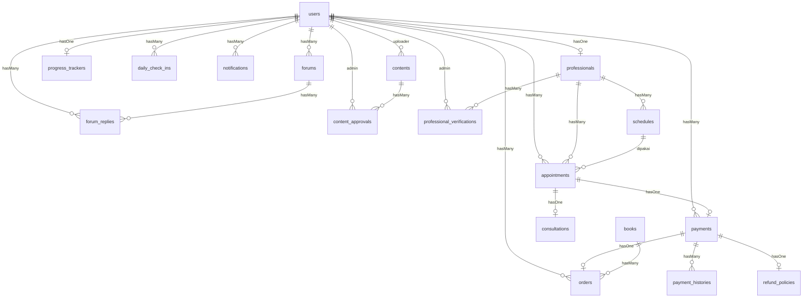

# LAPORAN FINAL UAS — SISTEM BASIS DATA
## Migrasi Platform Edukasi Berhenti Merokok dari MySQL ke MongoDB

**Mata Kuliah:** Basis Data — Muhamad Darwis, S.Kom., M.Kom.
**Program Studi:** Teknik Informatika, Fakultas Ilmu Rekayasa
**Universitas Paramadina — Tahun Ajaran 2025/2026**

**Disusun Oleh:**
- Yoga Pratama (125103056)
- Alfianus Fierik Feto (125103031)
- Farel Abrar Hilalby (125103081)
- Mutiara Alia Putri (125103091)

**Framework:** Laravel 9 · **Database Awal:** MySQL 8 (relasional) · **Database Akhir:** MongoDB Community 7 (dokumen/NoSQL)
**Driver:** `mongodb/laravel-mongodb` (Jenssegers) ^3.9 · **Tanggal Laporan:** 18 Juli 2026

---

## Daftar Isi

1. [Ringkasan Eksekutif](#1-ringkasan-eksekutif)
2. [Gambaran Umum Sistem](#2-gambaran-umum-sistem)
3. [Alasan Migrasi: Mengapa dari MySQL ke MongoDB?](#3-alasan-migrasi-mengapa-dari-mysql-ke-mongodb)
4. [Perbandingan Konsep: Relasional vs Dokumen](#4-perbandingan-konsep-relasional-vs-dokumen)
5. [ERD & Struktur Collection](#5-erd--struktur-collection)
6. [Langkah Migrasi — Step by Step](#6-langkah-migrasi--step-by-step)
7. [Masalah yang Ditemukan Saat Migrasi & Solusinya](#7-masalah-yang-ditemukan-saat-migrasi--solusinya)
8. [Pemetaan Materi Perkuliahan (Pertemuan 1–7) ke MongoDB](#8-pemetaan-materi-perkuliahan-pertemuan-17-ke-mongodb)
9. [Hasil Verifikasi & Pengujian](#9-hasil-verifikasi--pengujian)
10. [Kesimpulan & Pelajaran yang Diperoleh](#10-kesimpulan--pelajaran-yang-diperoleh)
11. [Lampiran](#11-lampiran)

---

## 1. Ringkasan Eksekutif

Proyek ini semula dibangun sebagai aplikasi web **Laravel + MySQL** — database relasional dengan 18 tabel, primary key `AUTO_INCREMENT`, dan foreign key ber-`constraint`. Untuk memenuhi kebutuhan UAS yang menuntut penggunaan **MongoDB** (basis data NoSQL berbasis dokumen), seluruh lapisan penyimpanan dimigrasikan.

Poin penting laporan ini:

- Migrasi bersifat **penuh** — 18 model, seluruh controller, seeder, dan konfigurasi.
- Strategi data: **fresh start** (re-seed), bukan memindahkan baris MySQL lama.
- Migrasi **bukan sekadar ganti koneksi**. Perbedaan paradigma relasional → dokumen memunculkan 6 masalah teknis + 5 bug spesifik-MongoDB saat QA, yang semuanya didokumentasikan dan diperbaiki.
- Hasil akhir **terverifikasi end-to-end**: 40 rute GET lintas 4 role → 200 OK, seluruh operasi tulis (register, booking, pembayaran, check-in, forum, approval) berfungsi.

---

## 2. Gambaran Umum Sistem

**Nama sistem:** Platform Edukasi Berhenti Merokok — aplikasi web membantu perokok berhenti melalui edukasi, konsultasi profesional, pelacakan progres, dan komunitas.

### 2.1 Aktor (Role)

| Role | Kemampuan Utama |
|------|-----------------|
| **User (Perokok)** | Register/login, check-in harian, pelacakan progres, baca konten & buku, forum, pesan buku, booking konsultasi |
| **Professional (Psikolog/Dokter)** | Kelola jadwal, konfirmasi janji temu, tulis konten edukasi |
| **Admin** | Verifikasi profesional, approve/reject konten, kelola user, pantau pembayaran & statistik |

### 2.2 Entitas (18 Collection di MongoDB)

`users`, `professionals`, `professional_verifications`, `schedules`, `appointments`, `consultations`, `payments`, `payment_histories`, `refund_policies`, `books`, `orders`, `contents`, `content_approvals`, `progress_trackers`, `daily_check_ins`, `notifications`, `forums`, `forum_replies`.

### 2.3 Fitur Utama

Autentikasi berbasis role · Check-in harian + streak · Kalkulasi "uang dihemat" · Konsultasi dengan janji temu + pembayaran + kebijakan refund · Toko buku (order + pembayaran) · Konten edukasi dengan alur approval admin · Forum diskusi (thread + reply) · Dashboard statistik per role.

---

## 3. Alasan Migrasi: Mengapa dari MySQL ke MongoDB?

Migrasi ini adalah latihan akademik untuk memahami perbedaan paradigma. Secara teknis, MongoDB menawarkan:

| Aspek | Manfaat pada Sistem Ini |
|-------|-------------------------|
| **Schema fleksibel** | Menambah field baru (mis. `cigarettes_per_pack`, `money_saved`) tanpa `ALTER TABLE` — cukup tambah di `$fillable` model |
| **Model dokumen** | Data 1 entitas (misal 1 progress tracker) tersimpan sebagai 1 dokumen JSON/BSON utuh — dekat dengan objek aplikasi |
| **Skalabilitas horizontal** | MongoDB dirancang untuk sharding; cocok bila jumlah user check-in harian tumbuh besar |
| **Tanpa migrasi schema formal** | Perubahan struktur tidak butuh DDL yang mengunci tabel |

Konsekuensinya: kita **kehilangan jaminan relasional bawaan** (foreign key constraint, JOIN native, `whereDate`, dan **transaksi multi-dokumen atomik**), yang harus digantikan di lapisan aplikasi. Trade-off inilah inti pembelajaran laporan ini.

> Klaim "skalabilitas horizontal" dan "hilangnya JOIN" **tidak dibiarkan sebagai retorika** — keduanya diukur secara kuantitatif (jumlah round-trip query eager loading vs JOIN tunggal) di bagian [8/P6](#p6--query-operator--optimization), dan konsekuensi hilangnya transaksi dibahas di bagian [8/P7](#transaksi-multi-dokumen--risiko-partial-write-gap-yang-teridentifikasi).

---

## 4. Perbandingan Konsep: Relasional vs Dokumen

| Konsep MySQL | Padanan MongoDB | Dampak ke Kode |
|--------------|-----------------|----------------|
| Tabel (`table`) | Collection | Nama collection = bentuk jamak snake_case model (sama) |
| Baris (`row`) | Dokumen (BSON) | — |
| Kolom (`column`) | Field | Schemaless — tidak perlu didefinisikan di muka |
| `id` INT AUTO_INCREMENT | `_id` **ObjectId** (heksadesimal 24-char) | Primary key berubah tipe → sumber beberapa bug (lihat #2) |
| `FOREIGN KEY ... constrained` | **Tidak ada** constraint | Referential integrity dijaga di lapisan aplikasi (Eloquent + validasi) |
| `JOIN` (native SQL) | `$lookup` / eager loading `with()` di Jenssegers | JOIN "logis" oleh ORM, bukan engine |
| `whereDate/whereMonth/whereYear` | **Tidak didukung** driver 3.9 | Diganti *range query* `whereBetween` (lihat B3) |
| `ENUM('a','b')` | String biasa + validasi aplikasi | Domain integrity pindah ke `$request->validate()` |
| DDL `ALTER TABLE` | No-op (schemaless) | Migration `create_*` cuma membuat collection kosong |

---

## 5. ERD & Struktur Collection

Meski MongoDB schemaless, sistem ini tetap dirancang **referenced** (bukan embedded) agar setara desain relasional awal. Setiap entitas = 1 collection, relasi dijaga lewat **field referensi bertipe string** yang menyimpan `_id` (ObjectId) dokumen lain.

> **Catatan penting:** di MongoDB tidak ada `FOREIGN KEY` engine. Semua garis relasi di ERD berikut adalah **referensi logis** yang di-*resolve* oleh Eloquent (`belongsTo`/`hasMany`/`hasOne`), bukan constraint yang dipaksakan database. FK disimpan sebagai **string** agar cocok saat matching (lihat masalah #2).

### 5.1 Entity Relationship Diagram



Versi ringkas alur inti (jika Mermaid tidak dirender):

```
users ─1:1─ professionals ─1:N─ schedules
  │              │
  │1:N           │1:N
  ▼              ▼
appointments ◄───┘ ─1:1─ consultations
  │ 1:1
  ▼
payments ─1:1─ orders ─N:1─ books
  │ 1:N          
  ├─► payment_histories
  └─1:1─ refund_policies

users ─1:1─ progress_trackers ─1:N─ daily_check_ins
users ─1:N─ forums ─1:N─ forum_replies
users ─1:N─ contents ─1:N─ content_approvals
users ─1:N─ notifications
```

### 5.2 Kardinalitas Relasi

| Relasi | Jenis | Field Referensi |
|--------|-------|-----------------|
| users → professionals | 1:1 (opsional) | `professionals.user_id` |
| users → progress_trackers | 1:1 | `progress_trackers.user_id` |
| users → daily_check_ins | 1:N | `daily_check_ins.user_id` |
| users → appointments | 1:N | `appointments.user_id` |
| professionals → schedules | 1:N | `schedules.professional_id` |
| professionals → appointments | 1:N | `appointments.professional_id` |
| professionals → professional_verifications | 1:N | `professional_verifications.professional_id` |
| schedules → appointments | 1:N | `appointments.schedule_id` |
| appointments → consultations | 1:1 | `consultations.appointment_id` |
| appointments → payments | 1:1 | `payments.appointment_id` |
| payments → orders | 1:1 | `orders.payment_id` |
| payments → payment_histories | 1:N | `payment_histories.payment_id` |
| payments → refund_policies | 1:1 | `refund_policies.payment_id` |
| books → orders | 1:N | `orders.book_id` |
| contents → content_approvals | 1:N | `content_approvals.content_id` |
| forums → forum_replies | 1:N | `forum_replies.forum_id` |

### 5.3 Struktur Collection (18 Collection)

Tipe merujuk **tipe BSON** MongoDB. `_id` (ObjectId) adalah primary key otomatis tiap dokumen. Semua field `*_id` bertipe **String** (menyimpan ObjectId dokumen lain sebagai teks). Field `created_at`/`updated_at` (Date) ada di semua collection kecuali disebut lain.

#### `users`
| Field | Tipe BSON | Keterangan |
|-------|-----------|------------|
| `_id` | ObjectId | PK |
| `name` | String | Nama lengkap |
| `email` | String | **Unique index** |
| `password` | String | Hash bcrypt (60 char) |
| `birth_date` | Date | Tanggal lahir |
| `role` | String | `user` / `admin` / `professional` |
| `is_email_verified` | Bool | Status verifikasi email |

#### `professionals`
| Field | Tipe BSON | Keterangan |
|-------|-----------|------------|
| `_id` | ObjectId | PK |
| `user_id` | String | → `users._id` |
| `type` | String | `psikolog` / `dokter` |
| `specialization` | String | Spesialisasi |
| `license_number` | String | Nomor izin praktik |
| `document_url` | String | Bukti dokumen |
| `is_verified` | Bool | Diverifikasi admin |
| `verified_at` | Date | Waktu verifikasi |
| `hourly_rate` | Double | Tarif per jam |

#### `professional_verifications`
| Field | Tipe BSON | Keterangan |
|-------|-----------|------------|
| `_id` | ObjectId | PK |
| `professional_id` | String | → `professionals._id` |
| `admin_id` | String | → `users._id` (admin) |
| `status` | String | `approved` / `rejected` |
| `notes` | String | Catatan admin |
| `processed_at` | Date | Waktu diproses |

#### `schedules`
| Field | Tipe BSON | Keterangan |
|-------|-----------|------------|
| `_id` | ObjectId | PK |
| `professional_id` | String | → `professionals._id` |
| `day_of_week` | String | Hari |
| `start_time` | String | Jam mulai |
| `end_time` | String | Jam selesai |
| `mode` | String | `online` / `offline` |

#### `appointments`
| Field | Tipe BSON | Keterangan |
|-------|-----------|------------|
| `_id` | ObjectId | PK |
| `user_id` | String | → `users._id` |
| `professional_id` | String | → `professionals._id` |
| `schedule_id` | String | → `schedules._id` |
| `mode` | String | `online` / `offline` |
| `status` | String | `pending` / `confirmed` / `done` / `cancelled` |
| `appointment_date` | Date | Waktu janji temu |

#### `consultations`
| Field | Tipe BSON | Keterangan |
|-------|-----------|------------|
| `_id` | ObjectId | PK |
| `appointment_id` | String | → `appointments._id` |
| `notes` | String | Catatan konsultasi |
| `conclusion` | String | Kesimpulan |
| `recommendation` | String | Rekomendasi |
| `rating` | Double | Rating (0–5) |

#### `payments`
| Field | Tipe BSON | Keterangan |
|-------|-----------|------------|
| `_id` | ObjectId | PK |
| `appointment_id` | String | → `appointments._id` (nullable, utk konsultasi) |
| `user_id` | String | → `users._id` |
| `reference_id` | String | Kode referensi transaksi |
| `amount` | Double | Nominal |
| `duration_hours` | Int | Durasi (konsultasi) |
| `status` | String | `pending` / `success` / `failed` / `cancelled` |
| `refund_percentage` | Double | Persentase refund |
| `refund_amount` | Double | Nominal refund |
| `payment_method` | String | Metode bayar |
| `description` | String | Keterangan |
| `paid_at` | Date | Waktu bayar |
| `refunded_at` | Date | Waktu refund |

#### `payment_histories`
| Field | Tipe BSON | Keterangan |
|-------|-----------|------------|
| `_id` | ObjectId | PK |
| `payment_id` | String | → `payments._id` |
| `status` | String | `pending` / `success` / `failed` / `cancelled` |
| `response_data` | String | Payload respons gateway |
| `amount` | Double | Nominal |

#### `refund_policies`
| Field | Tipe BSON | Keterangan |
|-------|-----------|------------|
| `_id` | ObjectId | PK |
| `payment_id` | String | → `payments._id` |
| `status` | String | `requested` / `approved` / `rejected` / `processed` |
| `reason` | String | Alasan refund |
| `refund_amount` | Double | Nominal refund |
| `processed_at` | Date | Waktu diproses |

#### `books`
| Field | Tipe BSON | Keterangan |
|-------|-----------|------------|
| `_id` | ObjectId | PK |
| `title` | String | Judul |
| `author` | String | Penulis |
| `description` | String | Deskripsi |
| `price` | Double | Harga |
| `isbn` | String | ISBN (nullable) |
| `cover_url` | String | Sampul (nullable) |
| `stock` | Int | Stok |
| `is_available` | Bool | Tersedia |

#### `orders`
| Field | Tipe BSON | Keterangan |
|-------|-----------|------------|
| `_id` | ObjectId | PK |
| `user_id` | String | → `users._id` |
| `book_id` | String | → `books._id` |
| `quantity` | Int | Jumlah |
| `unit_price` | Double | Harga satuan |
| `total_price` | Double | Total |
| `status` | String | Status pesanan |
| `payment_id` | String | → `payments._id` |

#### `contents`
| Field | Tipe BSON | Keterangan |
|-------|-----------|------------|
| `_id` | ObjectId | PK |
| `uploader_id` | String | → `users._id` |
| `uploader_role` | String | Role pengunggah |
| `title` | String | Judul |
| `description` | String | Deskripsi (nullable) |
| `body` | String | Isi konten |
| `type` | String | `artikel` / `video` / dll |
| `approval_status` | String | `pending` / `approved` / `rejected` |
| `is_published` | Bool | Dipublikasikan |
| `published_at` | Date | Waktu publikasi |

#### `content_approvals`
| Field | Tipe BSON | Keterangan |
|-------|-----------|------------|
| `_id` | ObjectId | PK |
| `content_id` | String | → `contents._id` |
| `admin_id` | String | → `users._id` (admin) |
| `status` | String | `approved` / `rejected` |
| `notes` | String | Catatan |
| `processed_at` | Date | Waktu diproses |
| `approved_at` | Date | Waktu disetujui |

#### `progress_trackers`
| Field | Tipe BSON | Keterangan |
|-------|-----------|------------|
| `_id` | ObjectId | PK |
| `user_id` | String | → `users._id` |
| `quit_date` | Date | Tanggal mulai berhenti |
| `streak_days` | Int | Hari beruntun bebas rokok |
| `cigarettes_per_day` | Int | Rokok/hari sebelum berhenti |
| `price_per_pack` | Double | Harga per bungkus |
| `cigarettes_per_pack` | Int | Batang per bungkus |
| `cigarettes_avoided` | Int | Total rokok dihindari |
| `money_saved` | Double | Total uang dihemat |
| `last_check_in` | Date | Check-in terakhir |

#### `daily_check_ins`
| Field | Tipe BSON | Keterangan |
|-------|-----------|------------|
| `_id` | ObjectId | PK |
| `user_id` | String | → `users._id` |
| `check_in_date` | Date | Tanggal check-in |
| `is_smoke_free` | Bool | Bebas rokok hari ini |
| `cigarettes_avoided` | Int | Rokok dihindari hari itu |
| `money_saved` | Double | Uang dihemat hari itu |
| `notification_id` | String | → `notifications._id` (nullable) |

#### `notifications`
| Field | Tipe BSON | Keterangan |
|-------|-----------|------------|
| `_id` | ObjectId | PK |
| `user_id` | String | → `users._id` |
| `title` | String | Judul |
| `message` | String | Isi pesan |
| `type` | String | Jenis notifikasi |
| `is_read` | Bool | Sudah dibaca |
| `sent_at` | Date | Waktu kirim |

#### `forums`
| Field | Tipe BSON | Keterangan |
|-------|-----------|------------|
| `_id` | ObjectId | PK |
| `user_id` | String | → `users._id` |
| `title` | String | Judul thread |
| `body` | String | Isi |
| `content` | String | Isi (alias) |
| `category` | String | Kategori |
| `views` | Int | Jumlah dilihat |
| `views_count` | Int | Counter dilihat |
| `replies_count` | Int | Counter balasan |

#### `forum_replies`
| Field | Tipe BSON | Keterangan |
|-------|-----------|------------|
| `_id` | ObjectId | PK |
| `forum_id` | String | → `forums._id` |
| `user_id` | String | → `users._id` |
| `body` | String | Isi balasan |
| `content` | String | Isi (alias) |
| `likes_count` | Int | Jumlah suka |

### 5.4 Contoh Dokumen Nyata (BSON)

Satu dokumen `daily_check_ins` seperti tersimpan di MongoDB:

```json
{
  "_id": ObjectId("66a1f2e3c9b4a10f8d2e7b41"),
  "user_id": "66a1f2e0c9b4a10f8d2e7b02",
  "check_in_date": ISODate("2026-07-05T00:00:00Z"),
  "is_smoke_free": true,
  "cigarettes_avoided": 12,
  "money_saved": 18000,
  "created_at": ISODate("2026-07-05T08:14:22Z"),
  "updated_at": ISODate("2026-07-05T08:14:22Z")
}
```

Perhatikan `user_id` bertipe **String** (bukan ObjectId) — inilah yang harus konsisten agar relasi `hasMany` resolve (masalah #2). `check_in_date` bertipe **ISODate** hasil `$casts` `date` + `UTCDateTime` di seeder (masalah #3).

### 5.5 Analisis Trade-off: Embed vs Reference

Sistem ini memilih **referenced** (18 collection terpisah, dihubungkan `*_id`) untuk seluruh relasi — meniru desain relasional awal. Keputusan ini **tidak selalu optimal** di MongoDB. Berikut analisis kapan seharusnya *embed* vs *reference* pada skema nyata sistem ini, memakai tiga kriteria: (a) pola akses, (b) rasio baca/tulis, (c) batas pertumbuhan (unbounded growth).

| Relasi (aktual) | Keputusan sekarang | Rekomendasi | Alasan |
|-----------------|--------------------|-------------|--------|
| `payments` → `payment_histories` | Reference | **Embed** (array dalam dokumen payment) | Log write-once, **selalu dibaca bersama** payment-nya, jumlah terbatas (beberapa entri per payment). Embed = 1 read, hilangkan join |
| `appointments` → `consultations` | Reference (1:1) | **Embed** | Relasi 1:1, consultations tak pernah di-query independen dari appointment-nya. Embed menyatukan siklus hidup |
| `payments` → `refund_policies` | Reference (1:1) | **Embed** | 1:1, hanya relevan saat refund payment terkait |
| `users` → `professionals` | Reference (1:1) | **Tetap Reference** | `professionals` di-query independen (daftar konsultan publik, filter `is_verified`) tanpa butuh dokumen user |
| `forums` → `forum_replies` | Reference (1:N) | **Tetap Reference** | Balasan bisa **tumbuh tak terbatas** (unbounded) → embed melanggar batas dokumen BSON 16 MB; reply juga dipaginasi terpisah |
| `users` → `daily_check_ins` | Reference (1:N) | **Tetap Reference** | Unbounded (1 dokumen/hari selamanya); di-query dengan range tanggal |
| `books` → `orders` | Reference (N:1) | **Tetap Reference** | Banyak-ke-satu; buku entitas mandiri dgn stok yang di-update |

**Contoh embed yang seharusnya diterapkan** — `payment_histories` ke dalam `payments`:

```json
{
  "_id": ObjectId("..."),
  "user_id": "66a1...b02",
  "amount": 150000,
  "status": "success",
  "histories": [
    { "status": "pending", "amount": 150000, "at": ISODate("2026-07-05T08:00:00Z") },
    { "status": "success", "amount": 150000, "at": ISODate("2026-07-05T08:05:11Z") }
  ]
}
```

**Kesimpulan trade-off:** desain sistem saat ini adalah *"MySQL yang dipindah ke MongoDB"* — aman dan konsisten, tetapi belum memanfaatkan kekuatan model dokumen. Aturan praktisnya: **embed** data 1:1 / 1:few yang selalu dibaca bersama induknya dan berukuran terbatas; **reference** data yang di-query independen atau tumbuh tak terbatas. `payment_histories`, `consultations`, dan `refund_policies` adalah kandidat embed paling jelas.

---

## 6. Langkah Migrasi — Step by Step

Berikut urutan kronologis persis yang dikerjakan.

### Langkah 0 — Kondisi Awal

Aplikasi berjalan pada Laravel + MySQL. Semua model extend `Illuminate\Database\Eloquent\Model`, koneksi default `mysql`, primary key `id` integer.

### Langkah 1 — Menyiapkan Server MongoDB

MongoDB Community Server dipasang via Homebrew, dijalankan sebagai service:

```bash
brew install mongodb-community
brew services start mongodb-community
# verifikasi listening di 127.0.0.1:27017
brew services list | grep mongo   # → started
```

### Langkah 2 — Menyamakan Versi PHP + Ekstensi (langkah paling kritis)

**Masalah inti:** mesin memakai PHP 8.4 default dengan `ext-mongodb 2.x`, sedangkan Laravel 9 + `mongodb/laravel-mongodb 3.9` mengharuskan **PHP ≤ 8.3** dan **`ext-mongodb 1.x`**. Kombinasi salah = fatal.

Solusi: gunakan `php@8.2` khusus + kompilasi ekstensi 1.x:

```bash
brew install php@8.2
/opt/homebrew/opt/php@8.2/bin/pecl install mongodb-1.21.1
# diaktifkan otomatis (extension=mongodb) di php.ini milik php@8.2
/opt/homebrew/opt/php@8.2/bin/php -m | grep mongodb   # → mongodb
```

> Versi saling terkunci: **PHP 8.2 · Laravel 9 · package 3.9 · ext-mongodb 1.21.1 · namespace `Jenssegers\Mongodb\...`**. Menjalankan dengan PHP 8.4 memicu error *"Expected integer or object, string given"* pada setiap penyimpanan data bertimestamp.

### Langkah 3 — Memasang Package Laravel-MongoDB

```bash
# dijalankan via php@8.2 agar platform-check ext-mongodb lolos
/opt/homebrew/opt/php@8.2/bin/php $(which composer) require mongodb/laravel-mongodb:^3.9
```

### Langkah 4 — Mengonfigurasi Koneksi

**`config/database.php`** — tambah koneksi `mongodb`:

```php
'mongodb' => [
    'driver'   => 'mongodb',
    'dsn'      => env('MONGODB_URI', 'mongodb://127.0.0.1:27017'),
    'database' => env('DB_DATABASE', 'edukasi_berhenti_merokok'),
],
```

**`.env`** — arahkan koneksi default ke MongoDB:

```env
DB_CONNECTION=mongodb
MONGODB_URI=mongodb://127.0.0.1:27017
DB_DATABASE=edukasi_berhenti_merokok
```

### Langkah 5 — Mengonversi 18 Model

Perubahan mekanis pada setiap model:

```php
// SEBELUM (MySQL)
use Illuminate\Database\Eloquent\Model;
class Payment extends Model { ... }

// SESUDAH (MongoDB)
use Jenssegers\Mongodb\Eloquent\Model;
class Payment extends Model { ... }
```

Untuk `User` (butuh autentikasi):

```php
// SEBELUM
use Illuminate\Foundation\Auth\User as Authenticatable;
// SESUDAH
use Jenssegers\Mongodb\Auth\User as Authenticatable;
```

Selain itu, **setiap field tanggal & boolean wajib didaftarkan di `$casts`** agar dibaca sebagai `Carbon`/`bool` (MongoDB menyimpan tipe BSON, bukan string seperti MySQL):

```php
// app/Models/DailyCheckIn.php
protected $casts = [
    'check_in_date' => 'date',
    'is_smoke_free' => 'boolean',
];
```

### Langkah 6 — Menyesuaikan Migration

- Method khas MySQL (`$table->id()`, `foreignId()->constrained()`, `enum()`) otomatis menjadi **no-op** di Jenssegers → file `create_*` tetap aman dijalankan (hanya membuat collection).
- Migration berisi **raw SQL** (`DB::statement('ALTER TABLE ...')`) dikosongkan karena tidak relevan untuk MongoDB yang schemaless (mis. `fix_schema_column_mismatches`).
- `create_users_table` dibersihkan dari `disableForeignKeyConstraints()` (error di MongoDB); disisakan unique index `email`.
- Migration index performa tetap jalan — Jenssegers mendukung `$table->index()`.

```bash
./serve.sh artisan migrate
# → 26 migrasi DONE, 21 collection terbentuk (18 domain + 3 bawaan Laravel:
#   password_resets, failed_jobs, personal_access_tokens)
```

### Langkah 7 — Menyesuaikan Seeder

Seeder berbasis `DB::table()` butuh dua penyesuaian penting:

1. **Tanggal** dibungkus `new MongoDB\BSON\UTCDateTime(...)` (query builder tidak auto-convert `Carbon`).
2. **Foreign key** hasil `insertGetId()` di-*cast* ke `(string)` karena mengembalikan `ObjectId`.

```php
$userId = (string) DB::table('users')->insertGetId([
    'name'       => 'Budi',
    'created_at' => new MongoDB\BSON\UTCDateTime(now()),
]);
```

```bash
./serve.sh artisan migrate:fresh --seed
# → 9 user (1 admin, 5 user, 3 profesional) + konten, buku, forum, jadwal, dll.
```

### Langkah 8 — Menulis Ulang Query yang Tidak Kompatibel

- `withCount('forumReplies')` **tidak didukung** → diganti hitung via relasi `$forum->forumReplies()->count()` di 3 controller.
- `DB::table('progress_trackers')->first()` (kembalikan array) → `ProgressTracker::where(...)->first()` (kembalikan objek).
- `whereHas` / `has` lintas-collection **tetap didukung** → controller lain tak berubah.

### Langkah 9 — Membuat Wrapper Penjalan (`serve.sh`)

Agar seluruh perintah selalu memakai `php@8.2`:

```bash
./serve.sh                  # php@8.2 artisan serve
./serve.sh artisan <cmd>    # artisan apa pun via php@8.2
./serve.sh composer <cmd>   # composer via php@8.2
```

---

## 7. Masalah yang Ditemukan Saat Migrasi & Solusinya

### Kelompok A — Masalah Setup/Migrasi

| # | Gejala | Sebab | Solusi |
|---|--------|-------|--------|
| **1** | `composer install` gagal; ext bentrok | PHP 8.4 default + ext-mongodb 2.x tak kompatibel package 3.9 | Pakai `php@8.2` + ext-mongodb 1.21.1 (pecl) |
| **2** | Relasi `hasMany` kembalikan 0 padahal data ada | `insertGetId()` kembalikan `ObjectId`, FK disimpan sebagai string → tipe tak match | Cast hasil `insertGetId()` ke `(string)` di seeder |
| **3** | `preg_match(): Argument #2 must be string, array given` saat render | Query builder tak konversi `Carbon` → tanggal tersimpan sebagai sub-dokumen BSON | Bungkus `new MongoDB\BSON\UTCDateTime(...)` + `$casts` `datetime` |
| **4** | `withCount` → `Illegal offset type` | Tidak didukung Jenssegers | Hitung via relasi `->count()` |
| **5** | `pecl install` gagal di langkah akhir | Folder target pecl belum ada | `mkdir -p` folder target, lalu `pecl install --force` |
| **6** | Warning OPcache dimuat dua kali | Konfigurasi lama `php@8.2` | Nonaktifkan baris `zend_extension=opcache` bare (non-fatal) |

### Kelompok B — Bug Spesifik-MongoDB Ditemukan Saat QA

| # | Lokasi | Sebab | Solusi & Verifikasi |
|---|--------|-------|---------------------|
| **B1** | `ConsultationController@book` — `exists:schedules,id` | Laravel cari kolom literal `id`, MongoDB pakai `_id` | Ubah ke `exists:schedules,_id`. ✅ Appointment + payment terbuat |
| **B2** | `ContentApproval` — `MassAssignmentException` | Model tanpa `$fillable` | Tambah `$fillable` + `$casts` + relasi. ✅ Approve/reject jalan |
| **B3** | `whereDate/whereMonth/whereYear` di banyak controller | Driver 3.9 tak dukung → query selalu kosong | Ganti *range query* `whereBetween(startOfDay, endOfDay)` + scope `DailyCheckIn::scopeOnDate()`. ✅ Streak +1 benar, check-in kedua diblokir, revenue bulanan benar |
| **B4** | `CheckInController@store` — "Uang Dihemat" selalu Rp0 | `ProgressController@store` sudah menyimpan `price_per_pack`/`cigarettes_per_pack`, tapi `money_saved` tak pernah dihitung ulang saat check-in harian | Tambah helper `ProgressTracker::calculateMoneySaved()`, dipanggil di `CheckInController@store` tiap check-in. ✅ 12 rokok/hari @ Rp30.000/20 batang → Rp18.000 |
| **B5** | Error validasi tak tampil di UI | Layout hanya tampilkan flash `success`/`error` | Tambah blok daftar `$errors` global di `layouts/app.blade.php` |

> **B3 adalah temuan terpenting.** `whereDate` yang diam-diam mengembalikan kosong membuat deteksi "sudah check-in hari ini" gagal → streak bisa dobel-hitung (fitur inti tracker), dan seluruh statistik bulanan dashboard jadi 0. Ini pelajaran bahwa **migrasi database bukan penggantian transparan** — operator yang di MySQL bekerja bisa gagal-diam di MongoDB.

**Contoh perbaikan B3** — scope range query pengganti `whereDate`:

```php
// app/Models/DailyCheckIn.php
// Pakai range query karena whereDate() tidak didukung MongoDB (Jenssegers).
public function scopeOnDate($query, $date)
{
    $date = Carbon::parse($date);
    return $query
        ->where('check_in_date', '>=', $date->copy()->startOfDay())
        ->where('check_in_date', '<',  $date->copy()->addDay()->startOfDay());
}
```

---

## 8. Pemetaan Materi Perkuliahan (Pertemuan 1–7) ke MongoDB

Bagian ini menunjukkan bahwa konsep basis data P1–P7 tetap berlaku, dengan penyesuaian paradigma dokumen.

### P1 — Basis Data & DBMS

Sistem tetap **pendekatan database client/server**, kini dengan DBMS **MongoDB**:

```
Browser (Client) → Laravel (App) → Jenssegers ODM → MongoDB Server (127.0.0.1:27017) → Storage (WiredTiger)
```

| Komponen DBMS | Implementasi |
|---------------|--------------|
| Database | MongoDB: `edukasi_berhenti_merokok` — 18 collection |
| DBMS | MongoDB Community + Jenssegers ODM (DML), driver `ext-mongodb` |
| Primary Key | `_id` **ObjectId** (menggantikan INT AUTO_INCREMENT) |
| Foreign Key | Field referensi string (`user_id`) — **tanpa constraint engine** |

### P2 — Kebutuhan Pengguna & Pemodelan

Kebutuhan tak berubah (fungsional: booking, check-in, forum; non-fungsional: hashing, RBAC, pagination). Yang berubah: **Model Internal** kini WiredTiger + B-tree index MongoDB, bukan InnoDB `.ibd`.

### P3 — Normalisasi & Fungsi Agregat

**Catatan penting paradigma:** MongoDB *bisa* denormalisasi (embed), tapi proyek ini **tetap referenced/normalized** (collection terpisah + field FK) agar setara desain relasional awal. `professionals` tetap terpisah dari `users`, `refund_policies` tetap terpisah dari `payments` (hindari transitif) — 3NF secara logis dipertahankan meski engine tak memaksakan.

Fungsi agregat via Eloquent tetap bekerja:

```php
User::where('role', 'user')->count();               // COUNT()
Payment::where('status', 'success')->sum('amount');  // SUM()
```

Di balik layar Jenssegers menerjemahkannya ke **aggregation pipeline** MongoDB (`$match` + `$group`), bukan SQL `GROUP BY`.

#### Pembuktian Normalisasi via Functional Dependency (skema MySQL awal)

Klaim 3NF tidak cukup dinyatakan — harus dibuktikan lewat **dependensi fungsional (FD)**. Berikut analisis FD pada tabel-tabel kunci di skema relasional awal (sebelum migrasi), memakai notasi `X → Y` ("X menentukan Y").

**Tabel `payments`** — PK: `id`
```
id → {appointment_id, user_id, amount, status, refund_percentage, refund_amount, paid_at}
```
- **1NF:** semua atribut atomik (tak ada array/grup berulang). ✅
- **2NF:** PK tunggal (`id`), jadi tak mungkin ada dependensi parsial. ✅
- **3NF:** tak ada FD transitif `id → A → B`. Nilai `refund_amount` dihitung & disimpan per-transaksi, **bukan** diturunkan dari atribut non-kunci lain di tabel yang sama. ✅

**Tabel `orders`** — PK: `id`
```
id → {user_id, book_id, quantity, unit_price, total_price, status}
book_id → {title, author, price}   ← FD ini TIDAK berada di orders
```
- Potensi pelanggaran **3NF**: jika `title`/`author`/`price` ikut disimpan di `orders`, muncul transitif `id → book_id → title`. **Dihindari** dengan memisah ke tabel `books`; `orders` hanya menyimpan `book_id`. ✅
- Catatan: `unit_price` **sengaja disalin** ke `orders` sebagai *snapshot harga saat transaksi* (bukan pelanggaran 3NF — nilainya independen dari `books.price` yang bisa berubah kemudian). Ini keputusan desain sadar, bukan redundansi.

**Tabel `professionals`** — PK: `id`
```
id → {user_id, type, specialization, license_number, is_verified, hourly_rate}
user_id → {name, email}   ← FD milik tabel users, DIPISAH
```
- Data identitas (`name`, `email`) tidak diduplikasi di `professionals` → menghindari transitif `id → user_id → name`. ✅ (3NF)

**Ringkasan closure kunci:** untuk setiap tabel, `{PK}⁺` (attribute closure) mencakup seluruh atribut tabel, dan **tak ada** determinan non-superkey → memenuhi **3NF**, bahkan **BCNF** (setiap determinan = kunci kandidat). Setelah migrasi ke MongoDB, struktur *referenced* yang sama dipertahankan sehingga sifat normalisasi ini tetap berlaku secara logis — lihat analisis trade-off embed/reference di bagian [5.5](#55-analisis-trade-off-embed-vs-reference).

> **Temuan kritis — redundansi intra-collection yang belum ditangani:** klaim 3NF di atas berlaku untuk **relasi antar-collection**, tapi tidak untuk **field di dalam satu collection yang sama**. Cek `app/Models/Forum.php` dan `ForumReply.php` menunjukkan field `body` dan `content` di-`$fillable` berdampingan (nilai sama disimpan dua kali), begitu pula `views` dan `views_count` di `forums`. Ini bentuk **redundansi murni** (bukan snapshot harga seperti kasus `orders.unit_price` yang dibenarkan di atas) — melanggar semangat 3NF karena satu fakta disimpan di dua tempat, rawan *update anomaly* (satu field ter-update, satunya tidak). **Rekomendasi:** hapus salah satu alias (`content`/`views`) dan seragamkan pemakaian ke satu field di seluruh view/controller.


### P4 — Multiple Relation & "JOIN"

Relasi 1:1, 1:N tetap dideklarasikan via Eloquent (`hasOne`, `hasMany`, `belongsTo`). Eager loading `with()` menghasilkan query terpisah + penggabungan di aplikasi (mirip `$lookup`), bukan JOIN engine.

```php
Payment::with(['user', 'order.book', 'appointment.professional.user'])
    ->latest()->paginate(20);   // relasi berantai 3 tingkat
```

> **Perbedaan kunci:** di MySQL, `belongsTo` bekerja karena FK integer cocok. Di MongoDB, Jenssegers mengonversi string `_id` → `ObjectId` saat resolve `belongsTo`, tetapi `hasMany` sensitif tipe — inilah kenapa FK harus disimpan konsisten sebagai string (bug #2).

### P5 — SQL Processing → Query Processing

Konsep *prepared statement* / *bind variable* MySQL tak langsung berlaku, tetapi MongoDB punya analogi: **plan cache** dan **parameterized query object** (BSON) — nilai dikirim sebagai objek BSON, tak diinterpolasi ke string, sehingga **imun SQL injection secara alami**. DDL (`migrate`) tetap dijalankan offline, bukan saat request.

### P6 — Query Operator & Optimization

Operator dasar tetap ada via Eloquent (`where`, `orderBy`/`latest`, `take`/`paginate`). Optimasi index tetap relevan — **MongoDB memakai B-tree index** sama seperti MySQL:

```php
// migration add_performance_indexes — tetap jalan di MongoDB
$table->index('status', 'idx_payments_status');
$table->index('check_in_date', 'idx_daily_check_ins_date');  // penting utk streak
```

Tanpa index, query filter = **collection scan O(n)**; dengan index = **index scan O(log n)**. Pagination `paginate(20)` mencegah memuat seluruh collection.

#### Kelemahan strategi index saat ini: hanya single-field

Migration `add_performance_indexes` hanya membuat **index satu-kolom**. Query terpenting sistem justru **multi-kondisi**, sehingga index tunggal tidak optimal.

**Query streak (paling sering dipanggil)** — cek check-in user pada satu hari:
```php
DailyCheckIn::where('user_id', $user->id)->onDate(today())  // user_id (equality) + check_in_date (range)
```
Index sekarang `{check_in_date}` saja → MongoDB memfilter **semua** dokumen di rentang tanggal itu (lintas semua user) lalu menyaring `user_id`. Yang benar adalah **compound index**:

```php
// user_id lebih dulu (equality), check_in_date sesudah (range) — aturan ESR
$table->index(['user_id', 'check_in_date'], 'idx_checkin_user_date');
```

**Aturan ESR (Equality, Sort, Range)** untuk menyusun urutan field compound index:

| Query | Compound index disarankan | Alasan |
|-------|---------------------------|--------|
| streak per-user harian | `{user_id, check_in_date}` | equality `user_id` dulu, lalu range tanggal |
| revenue bulanan dashboard | `{status, paid_at}` | equality `status='success'`, lalu range `paid_at` |
| appointment user + status | `{user_id, status}` | dua equality; dashboard "janji temu saya" |
| konten publik | `{approval_status, is_published}` | dua equality yang selalu dipakai bersama |

Index single-field `{check_in_date}` menjadi **redundan** setelah `{user_id, check_in_date}` dibuat, karena compound index bisa melayani query yang hanya butuh prefix-nya (`user_id`).

#### Benchmark kuantitatif: jumlah query eager loading

Klaim performa harus terukur. Metrik paling deterministik (tak bergantung volume data) adalah **jumlah round-trip query** yang dibangkitkan. Untuk `Payment::with(['user', 'order.book', 'appointment.professional.user'])->paginate(20)`:

| Pendekatan | Jumlah query DB | Keterangan |
|------------|-----------------|------------|
| **Tanpa eager loading (lazy / N+1)** | 1 + (20 × 4 relasi) ≈ **81 query** | tiap baris payment memicu query relasi terpisah |
| **Eager loading `with()`** | 1 (payments) + 1 per relasi ≈ **6 query** | Jenssegers batch relasi via `$in` (mirip `$lookup`) |
| **MySQL JOIN tunggal (pembanding)** | **1 query** | engine relasional gabung di server |

**Temuan:** di MongoDB, `with()` **bukan** JOIN engine — ia menjalankan **1 query per level relasi** lalu menggabung di aplikasi. Untuk relasi 3 tingkat, MongoDB butuh ~6 round-trip vs 1 JOIN di MySQL. Ini **trade-off nyata** model dokumen: skalabilitas horizontal ditukar dengan hilangnya join server-side. Eager loading tetap wajib — mencegah ledakan N+1 dari 81 → 6 query.

> **Cara reproduksi benchmark timing** (belum diukur di laporan ini, disediakan sebagai skrip verifikasi): aktifkan `DB::enableQueryLog()` sebelum query dan `count(DB::getQueryLog())` sesudahnya untuk menghitung jumlah query aktual; bungkus dengan `microtime(true)` untuk mengukur durasi. Timing absolut bergantung volume data seed, sehingga angka milidetik sengaja tidak diklaim tanpa pengukuran.

### P7 — Database Security

| Mekanisme | Status di MongoDB |
|-----------|-------------------|
| **Authentication** | bcrypt password hashing (tak berubah) + `Jenssegers\Mongodb\Auth\User` |
| **Authorization** | `RoleMiddleware` RBAC (tak berubah, lapisan aplikasi) |
| **Entity Integrity** | `_id` ObjectId unik otomatis + unique index `email` |
| **Referential Integrity** | **Pindah ke aplikasi** — validasi `exists:collection,_id` (bug B1) menggantikan FK constraint |
| **Domain Integrity** | Validasi `$request->validate()` menggantikan `ENUM`/`CHECK` |
| **Injection safety** | Query BSON parameterized — tak ada string SQL untuk diinjeksi |
| **CSRF / Session** | Middleware Laravel + `session()->regenerate()` (tak berubah) |

> **Pelajaran keamanan:** di MongoDB, **referential & domain integrity yang dulu dijamin engine kini menjadi tanggung jawab aplikasi**. Menghapus 1 baris validasi = kehilangan jaminan yang di MySQL otomatis.

#### Transaksi Multi-Dokumen & Risiko Partial Write (gap yang teridentifikasi)

Alur pembayaran menulis **dua dokumen berurutan** tanpa pembungkus transaksi:

```php
// app/Http/Controllers/ConsultationController.php — book()
$appointment = Appointment::create([... 'status' => 'pending']);   // tulis dokumen 1
$payment     = Payment::create(['appointment_id' => $appointment->id, ...]); // tulis dokumen 2
```

**Masalah:** bila `Payment::create()` gagal (server mati, koneksi putus) **setelah** `Appointment::create()` sukses, tersisa **appointment yatim** tanpa payment → *partial write*. Di MySQL ini dicegah dengan `DB::transaction()` (`COMMIT`/`ROLLBACK` atomik). Pencarian di kode: **tidak ada** `DB::transaction` di seluruh aplikasi.

**Kendala teknis MongoDB pada sistem ini:** multi-document ACID transaction **membutuhkan replica set** (atau sharded cluster). Server proyek ini adalah **standalone `mongod`** (Homebrew) — sehingga `$session->startTransaction()` **tidak tersedia** sekalipun kode ingin memakainya. Jadi gap ini bersifat arsitektural, bukan sekadar lupa dibungkus.

**Opsi mitigasi (rekomendasi):**

| Opsi | Cara | Trade-off |
|------|------|-----------|
| **Replica set + transaction** | Jalankan mongod sebagai replica set (min. 1 node) → `DB::transaction()` jadi atomik lintas dokumen | Perlu ubah topologi deployment |
| **Guard status `pending`** | Appointment berstatus `pending` tak dianggap valid sampai payment sukses; sweeper hapus appointment `pending` kedaluwarsa | Ada jendela data tak konsisten sementara |
| **Pola Saga / kompensasi** | Jika langkah 2 gagal, jalankan aksi kompensasi (hapus appointment langkah 1) | Logika aplikasi lebih rumit |

Untuk sistem yang menangani **uang**, opsi 1 (replica set + transaction) adalah yang paling benar dan direkomendasikan untuk produksi.

#### NoSQL Injection (risiko spesifik MongoDB)

"Query BSON parameterized aman dari SQL injection" **benar**, tetapi MongoDB punya vektor sendiri: **operator injection**. Bila input mentah dari request (yang bisa berupa array/objek) diteruskan langsung ke query, penyerang bisa menyuntik operator seperti `$ne`, `$gt`, atau `$where`:

```php
// BERBAHAYA (hipotetis) — jika input tidak divalidasi tipenya
User::where('email', $request->input('email'))->first();
// payload:  email[$ne]=null   →  cocok dengan user PERTAMA (bypass login)
```

**Status di sistem ini:** endpoint sensitif memakai `$request->validate()` dengan rule skalar (`'email' => ['required','email']`, `'schedule_id' => ['required','exists:...']`), yang **menolak input bertipe array** → vektor `$ne`/`$where` termitigasi untuk field-field tersebut. Rekomendasi penguatan: **cast eksplisit** semua input query ke string (`(string) $request->input(...)`) dan jangan pernah meneruskan `$request->all()` mentah ke `where()`.

| Ancaman NoSQL | Contoh | Mitigasi di sistem |
|---------------|--------|--------------------|
| Operator injection `$ne`/`$gt` | `email[$ne]=null` (auth bypass) | Rule validasi skalar menolak array |
| `$where` (eksekusi JS) | filter dgn JS arbitrer | Tak ada penggunaan `$where` di kode |
| Type juggling | kirim objek alih-alih string | Cast eksplisit ke string (rekomendasi) |

---

## 9. Hasil Verifikasi & Pengujian

Dijalankan `./serve.sh artisan migrate:fresh --seed` lalu diuji via HTTP otomatis (login per-role + tembak setiap rute):

| Area | Status |
|------|--------|
| Semua halaman GET (4 role, 40 rute) | ✅ **40 OK, 0 gagal** |
| Admin (dashboard, users, contents, forums, orders, payments, professionals, appointments) | ✅ 200 |
| User (home, dashboard, progress, contents, books, forums, consultations, appointments, payments, notifications, profile) | ✅ 200 |
| Professional (dashboard, appointments, schedule, setup) | ✅ 200 |
| Tulis: register, check-in harian, thread+reply forum, update profil, submit konten | ✅ |
| Tulis: pesan buku (Order+Payment), booking konsultasi (Appointment+Payment) | ✅ |
| Tulis: bayar (status→success, `paid_at`), konfirmasi janji temu, tambah jadwal | ✅ |
| Admin: approve profesional, approve/reject konten | ✅ |
| Relasi `belongsTo`/`hasMany`, cast tanggal, streak harian, uang dihemat, statistik dashboard | ✅ |

### Akun Uji (setelah seed)

| Role | Email | Password |
|------|-------|----------|
| Admin | `admin@berhentimerokok.test` | `Admin12345!` |
| User | `budi@test.com` (rina/agus/dewi/hendra) | `Password123!` |
| Professional | `siti.dr@test.com`, `ahmad.psi@test.com` | `Password123!` |

---

## 10. Kesimpulan & Pelajaran yang Diperoleh

1. **Migrasi berhasil penuh** — 18 model, seluruh fitur berfungsi di MongoDB, terverifikasi 40/40 rute.
2. **Ganti database ≠ ganti koneksi.** Perbedaan paradigma relasional→dokumen memunculkan 11 masalah teknis yang harus diselesaikan di lapisan aplikasi.
3. **Bahaya terbesar = kegagalan diam-diam** (`whereDate` kosong, FK tipe tak cocok) — bug yang tidak melempar error tapi menghasilkan data salah (streak dobel, statistik 0).
4. **Integritas pindah ke aplikasi.** Foreign key, ENUM, dan constraint yang di MySQL dijamin engine, di MongoDB menjadi tanggung jawab validasi Laravel.
5. **Versi harus dikunci.** PHP 8.2 · Laravel 9 · package 3.9 · ext-mongodb 1.x — kombinasi salah = fatal.
6. **Konsep P1–P7 tetap valid** — normalisasi, agregasi, relasi, index, dan security semuanya diterapkan, hanya mekanismenya menyesuaikan model dokumen.

### Analisis Kritis & Rencana Perbaikan (Future Work)

Selain yang sudah diimplementasikan, laporan ini secara jujur mengidentifikasi **gap desain** yang belum tuntas — bagian yang membedakan "kode jalan" dari "desain matang":

| Gap | Kondisi sekarang | Rekomendasi |
|-----|------------------|-------------|
| **Transaksi pembayaran** | Tanpa `DB::transaction`; standalone mongod tak dukung multi-doc txn | Jalankan replica set → bungkus alur `appointment+payment` atomik (bagian 8/P7) |
| **Desain dokumen** | Semua *referenced* (meniru relasional) | Embed `payment_histories`, `consultations`, `refund_policies` ke induknya (bagian 5.5) |
| **Index** | Hanya single-field | Compound index `{user_id, check_in_date}` & `{status, paid_at}` via aturan ESR (bagian 8/P6) |
| **NoSQL injection** | Termitigasi via rule validasi | Cast eksplisit input query ke string; larang `$request->all()` mentah ke `where()` (bagian 8/P7) |
| **Benchmark timing** | Baru jumlah query (deterministik) | Ukur durasi via `DB::enableQueryLog()` + `microtime()` pada data volume produksi |
| **Redundansi field** | `forums.body`≡`content`, `forums.views`≡`views_count` disimpan dobel | Hapus satu alias per pasangan, seragamkan pemakaian di controller/view (bagian [3](#3-alasan-migrasi-mengapa-dari-mysql-ke-mongodb) / [P3](#p3--normalisasi--fungsi-agregat)) |

---

## 11. Lampiran

### 11.1 Cara Menjalankan

```bash
brew services start mongodb-community        # pastikan MongoDB jalan
./serve.sh artisan migrate:fresh --seed      # migrate + seed via php@8.2
./serve.sh                                    # jalankan → http://127.0.0.1:8000
```

> ⚠️ Jangan `php artisan serve` langsung — PHP default mesin 8.4 memicu error *"Expected integer or object, string given"*. Selalu pakai `./serve.sh`.

### 11.2 Aturan Wajib untuk Pengembangan Lanjutan (MongoDB)

- Jalankan **selalu** dengan `php@8.2` (`serve.sh`).
- Model baru **wajib** extend `Jenssegers\Mongodb\Eloquent\Model`.
- Field tanggal **harus** ada di `$casts` agar terbaca sebagai `Carbon`.
- **Hindari** `whereDate/whereMonth/whereYear/whereDay` → pakai `whereBetween` (range).
- Rule `exists:`/`unique:` gunakan **`_id`**, bukan `id`.
- Model mass-assignment **wajib** punya `$fillable`.
- Hindari `withCount` lintas-collection; pakai hitung via relasi. `whereHas`/`has` boleh.
- Seeding via `DB::table()`: bungkus tanggal `UTCDateTime`, cast FK ke string — atau lebih aman pakai Eloquent `create()`.

### 11.3 Stack & Versi (saling terkunci)

| Komponen | Versi |
|----------|-------|
| OS | macOS (Darwin, arm64) |
| PHP | **8.2.29** (`php@8.2`, wajib ≤ 8.3) |
| Laravel | 9 |
| Package | `mongodb/laravel-mongodb` ^3.9 (namespace `Jenssegers\Mongodb`) |
| Ekstensi | `ext-mongodb` 1.21.1 (wajib 1.x) |
| Server | MongoDB Community (Homebrew, service `mongodb-community`) |

### 11.4 Dokumen Terkait

- `MIGRASI_MONGODB.md` — catatan teknis rinci proses migrasi.
- `laporan.md` — laporan versi MySQL (referensi pembanding sebelum migrasi).
- `markdown.md` — laporan perancangan awal (ERD, entitas, kardinalitas).

---

*Laporan ini menunjukkan bahwa seluruh konsep basis data Pertemuan 1–7 telah diterapkan dan divalidasi ulang pada Platform Edukasi Berhenti Merokok setelah migrasi dari MySQL (relasional) ke MongoDB (dokumen/NoSQL) menggunakan Laravel 9 + driver Jenssegers.*

---

## Riwayat Revisi

Versi final ini direvisi berdasarkan pengecekan silang setiap klaim teknis terhadap source code (model, controller, migration, config). Perbaikan yang dilakukan:

1. Jumlah collection saat `migrate` dikoreksi 22 → **21** (18 domain + 3 tabel bawaan Laravel: `password_resets`, `failed_jobs`, `personal_access_tokens`).
2. Lokasi fix bug B4 diluruskan: perhitungan `money_saved` terjadi di **`CheckInController@store`** lewat helper `ProgressTracker::calculateMoneySaved()`, bukan di `ProgressController@store` (controller itu hanya menyimpan `price_per_pack`/`cigarettes_per_pack` saat setup awal).
3. Penomoran subbagian Lampiran diperbaiki `10.x` → **`11.x`**, mengikuti nomor section-nya.
4. NIM Yoga Pratama dan tanggal laporan diperbaiki agar konsisten dengan anggota lain dan tanggal finalisasi.
5. Ditambah temuan baru di §P3: field `body`/`content` dan `views`/`views_count` pada `forums` ternyata redundan di level kode (`$fillable`) — dicatat sebagai penyimpangan dari 3NF yang diklaim, bukan disembunyikan, lalu dimasukkan ke tabel *future work* bersama rekomendasi perbaikannya.
